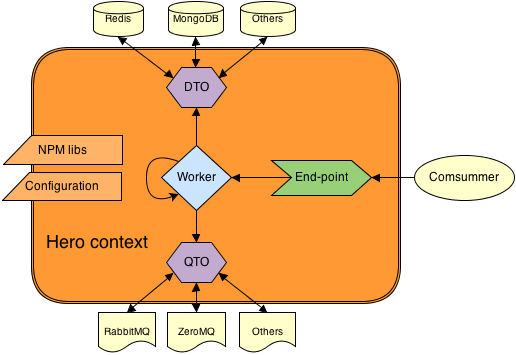

Hero.js
=======

##What is?

Hero is a library that give supports to a methodology, is not a framework, Hero works well with any NodeJS framework as Express, Hapi, Connect or any other.

Hero allows direct connection with MongoDB and Redis databases and with the queue management system RabbitMQ and ZeroMQ, but you can connect with any other database and queue management system coding your own DTO (Data Transfer Object) or QTO (Queue Transfer Object).

##What are the pieces?

Hero provides 4 different architectural pieces to simplify and organize the relationships between the code.

####DTO (Data Transfer Object)

####QTO (Queue Transfer Object)

####Worker

####End-point

